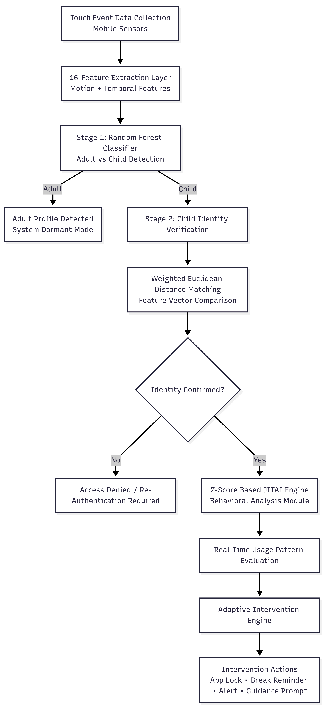
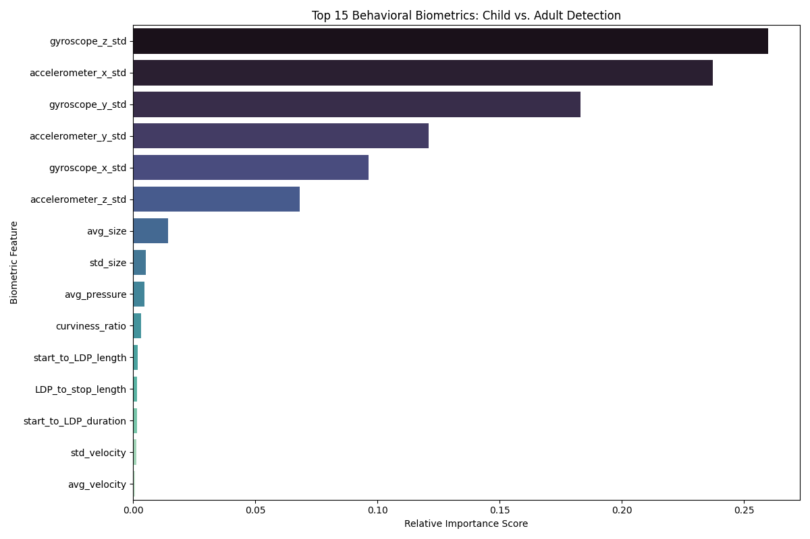
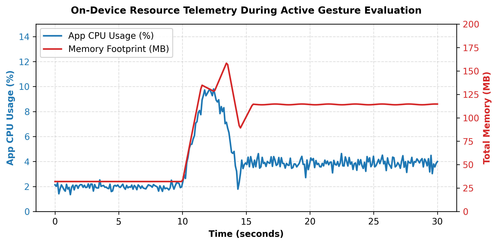

# MindGuard: Child-Aware Adaptive Method for Social Media Addiction Reduction

[]()
[]()
[]()

> **Final Year Research Dissertation | NSBM Green University**  
> *Author:* N.W.P.P.P. Nanayakkara  
> *Principal Supervisor:* Eng. Prabhath Buddhika  

---

## 📌 Executive Summary

Traditional digital wellbeing applications rely on static timers or easily circumvented PINs that fail on shared family devices. **MindGuard** is a novel, on-device Edge AI framework combining **Touch Biometrics**, **Inertial Sensor Fusion**, and **Just-In-Time Adaptive Interventions (JITAI)** to passively verify individual child profiles (ages 3–12) and mitigate compulsive social media overuse.

---
## 🎥 System Demonstration

Watch the live demonstration of the MindGuard AI monitoring, JITAI trigger, and gamified Break Mode in action:

[](https://www.youtube.com/watch?v=l_G8SUV_da0)

---
## 🏛️ System Architecture

The architecture operates entirely on-device to preserve privacy and minimize latency, using a two-stage hierarchical model:

<p align="center">
  
</p>

---

## 🔬 Core Engineering Innovations

### 1. Overcoming Capacitive Hardware Fragmentation
Empirical testing on commodity mid-range Android hardware (Tecno CM5) revealed that default digitizer drivers emit static, falsified values (`Touch Size = 0.043`, `Touch Pressure = 1.0`). To ensure hardware-agnostic deployment:
* The capacitive parameters are deprioritized.
* The system relies on **Spatial Curvature ($w = 500.0$)** and **Kinetic Postural Dynamics (Gyroscope X/Y)** to differentiate individual child motor patterns.

### 2. Eliminating Feature Entanglement via Velocity Decoupling
When a child enters rapid scrolling, raw velocity dramatically spikes. In traditional biometrics, this sudden variance breaks the identity classifier.
* **Solution:** Decoupled swipe velocity entirely from Stage 2 identity verification ($w_{\text{velocity}} = 0.0$).
* Velocity is routed exclusively into an adaptive **Z-Score Engine** ($Z > 3.5$) for addiction detection.

### 3. Human-AI Feedback Loop & JITAI
* **5-Strike Escalation:** Progressive nudging before forcing distraction-free Break Mode.
* **15-Second Integrity Timer:** Dynamically tightens the detection threshold from 3.5σ down to 1.5σ (Strict Mode) if a behavioral promise is broken.
* **Gamified Positive Reinforcement:** Replaces punitive hard locks with a 4-tier XP Avatar progression.

<p align="center">
  
  
  
  
</p>

---

## 📊 Key Results & Empirical Performance

| Metric | Touch-Only Baseline | MindGuard Sensor Fusion |
| :--- | :--- | :--- |
| **Stage 1 Age Classification Accuracy** | 72.00% | **82.34%** (+10.34%) |
| **Active Inference CPU Overhead** | — | **1 – 10%** (transient spikes) |
| **Steady-State Memory Footprint** | — | **~114 MB** (peak ~160 MB) |
| **Idle Battery / CPU Drain** | — | **0%** (Event-driven lifecycle) |
| **Profile Storage Footprint** | — | **< 20 KB** per child |

<br>

<p align="center">
  
  &nbsp; &nbsp;
  
</p>

---

## 🔒 Source Code Access Policy

> **Notice:** The full application source code, trained model weights, and proprietary telemetry logging modules are kept in a private repository due to ongoing university IP requirements and upcoming conference publication submissions.
>
> **Code Walkthroughs & Telemetry Data:**  
> Verified academic researchers and prospective technical employers can request access or schedule an architecture walkthrough by contacting:
> * **Email:** piumipramodya22@gmail.com
> * **LinkedIn:** [N.W.P.P.P. Nanayakkara](https://www.linkedin.com/in/piumi-pramodya-7695842a4)

---

## 📄 License & Intellectual Property

Copyright (c) 2026 N.W.P.P.P. Nanayakkara. All rights reserved.

The documentation, architectural specifications, and research assets in this repository are shared for academic evaluation, peer review, and verification purposes under [CC BY-NC-ND 4.0](https://creativecommons.org/licenses/by-nc-nd/4.0/). 

The underlying application source code, machine learning model weights, and proprietary telemetry logging pipelines remain the intellectual property of the author and NSBM Green University. Commercial use, unauthorized distribution, or reproduction of code is strictly prohibited.

---

## 📚 Citation

```bibtex
@inproceedings{nanayakkara2026mindguard,
  author    = {Nanayakkara, N. W. P. P. P. and Buddhika, R. A. Prabhath},
  title     = {Child-Aware Adaptive Method for Social Media Addiction Reduction},
  booktitle = {Proceedings of the Technological Innovations and Digital Advancement Conference (TIDAC)},
  year      = {2026},
  publisher = {IEEE}
}
